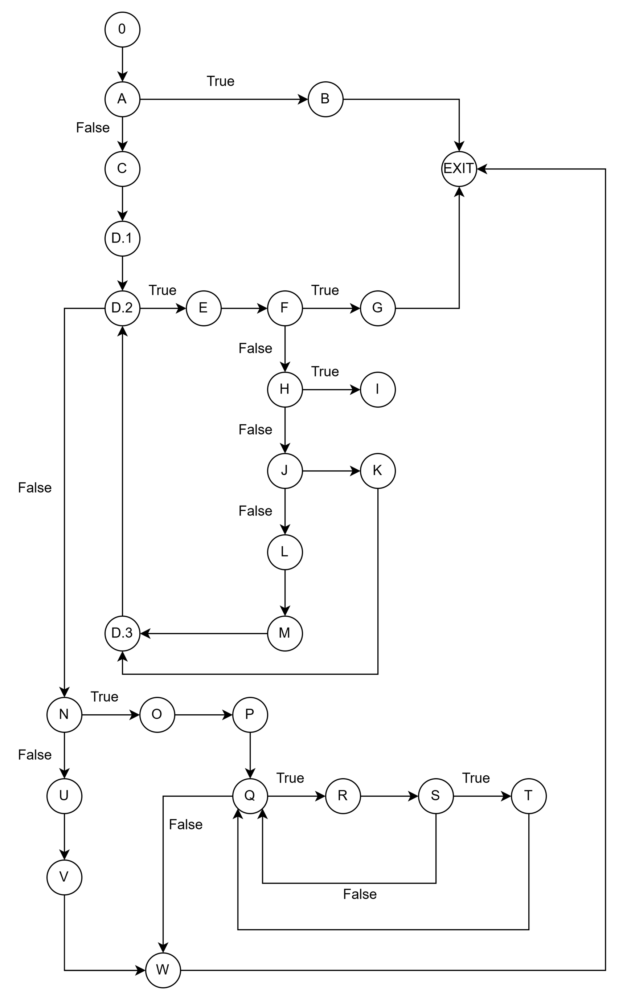

# Evgenija Postolova 223239

## 2. Control Flow Graph

## 3. Цикломатска комплексност

Цикломатската комплексност е 9

Предикатните јазли имаат две или повеќе различни патеки во CFG, тоа се A,D,F,H,J,N,Q,S  

  предикатни јазли + 1 = 8 + 1 = 9  
  
## 4. Тест случаи според критериумот Every statement

Потребни се минимум 5 тест случаи:
  4 тестови за да се поминат сите throw исклучоци и
  1 тест за успешно извршување до крај

## 5. Тест случаи според критериумот Multiple Condition

Потребни се минимум 4:  
FFF -> Ниту еден услов не е исполнет  
ТXX -> Првиот услов е true, останатите не се проверуваат  
FTX -> Вториот услов е true, последниот не се проверува  
FFT -> Третиот услов е true  
